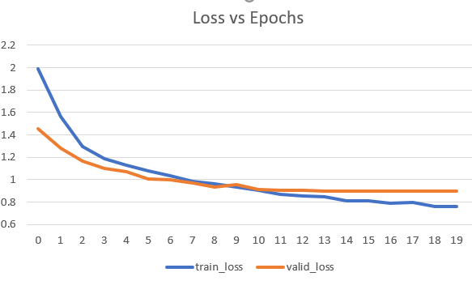
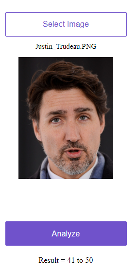
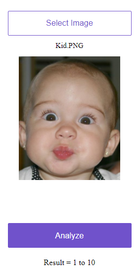
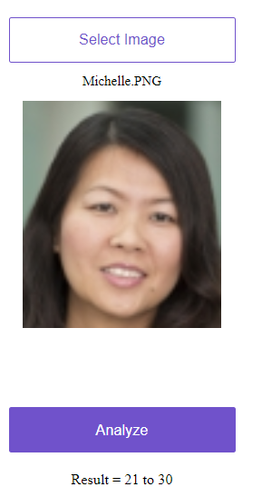

# Age Detection Using Deep Learning
## Goal 
This project leverages Deep Learning to predict a person's age group in a photo. 

Here is the live version of the App: https://age-detection.onrender.com/

## Idea
The idea was nothing very serious. Often age is considered to be a very sensitive topic for millenials. We often face situations were you end up guessing the age of the person as horribly wrong. So we toyed with the idea, why not use AI to do that for you. Deep Learning models are very powerful classifiers, and often can understand very small differences in data, sometimes not even obvious to the human eye.

## Data Set
UTKFace dataset is a large-scale face dataset with long age span (range from 0 to 116 years old). The dataset consists of over 20,000 face images with annotations of age, gender, and ethnicity. The images cover large variation in pose, facial expression, illumination, occlusion, resolution, etc. This dataset could be used on a variety of tasks, e.g., face detection, age estimation, age progression/regression, landmark localization, etc. 

## Approach
We tried and tested different things to approach the problem. 

### Image Regression
We use a deep learning model to predict the person's age by regression. The image regression gave terribly off results, because predicting the exact age was pretty tough for the model. Also looking at the data we realized that for the model to work accurately, predicting age group would be easier, as people around the same age group look similar.

### Image Classification
We segmented our data into age groups of 10 each respectively, starting from 0-10, 11-20, 21-30, 31-40, 41-50, 51-60 and 61+. This way we were able to predict age groups instead of actual age, more accurately. 

## Training the Model
We used the UTKFace Dataset. The individual age images were aggregated into age groups as mentioned above. Below is the snapshot of a sample training images. 

We used different model architectures and performed transfer learning to use them for our use case. Below are performances of different model architectures: 

| Model Architecture  | Accuracy |
| ------------- | ------------- |
| Resnet34  | 60%  |
| Resnet50  | 70% |
| VGG16  | 63% |
| VGG19  | 64% |
|Densenet121| 67% | 

We found that Resnet50 has the best validation accuracy and also was not overfitting too much with the training dataset. 

Below is the performance of the Resnet50 model: 

## Results

Below are certain good results from testing out the model 

    

    

 

But we also have certain even better results. 

 

 
  
The model has been deployed live on Render. However, since its a free account, please use image with smaller sizes, as their is a limit on computation allowed for free accounts. Preferably use images with your head covering major part of the image. 

Try for yourself at https://age-detection.onrender.com/ . 

We believe that you will love the wrong results more than the right ones :D . 

